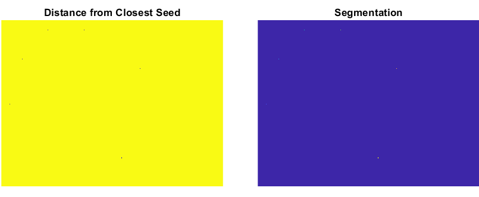
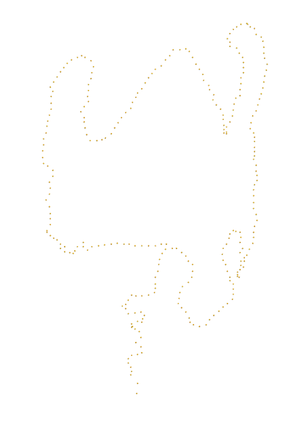
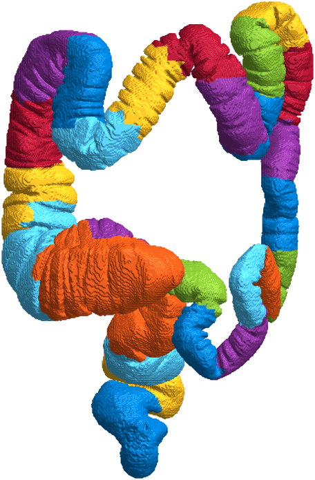

# *bwgrowregions*: Multi-class region growing for binary images

<!---->

Pixels are given the label of their closest seed, according to geodesic distance. The following GIF demonstrates the process. In this example, seeds with unique labels are placed at the wrist and the tip of each finger.

`bwgrowregions` is particularly useful for centerline- or skeleton-based segmentation, by finding the skeleton of an image, segmenting the skeleton, using it to define seeds, and growing the regions to cover the entire area of the image. For example, in figure (a) below, the centerline of the colon has been segmented into semantic segments, which is then transferred to the volume. In figure (b), the centerline has instead been split into a number of segments with a preset length.

| (a) | (b) |
|:--:|:--:|
|||

## Syntax

- `labels = bwgrowregions( I )`
- `labels = bwgrowregions( I, distanceMetric )`
- `[ labels, distanceTransform ] = bwgrowregions( __ )`

### Inputs

| Argument | Description |
| --- | --- |
| `I` | Image defining the traversable pixels and seed locations, given as a 2D or 3D numeric array. Must contain at least 1 seed. Note:<ul><li>Values of `0` represent unlabelled pixels which can be traversed. These will be labelled if a valid path exists, connecting it to any of the seeds.</li><li>Values of `NaN` represent pixels which cannot be traversed and will not be labelled. Paths between unlabelled pixels and seeds therefore avoid these regions.</li><li>All other values represent seeds, with the value defining that seed's label. The region grown from a seed is given that seed's label. Where an unlabelled pixel has a connected path to more than one seed, the seed with the lowest geodesic distance is selected.</li></ul> |
| `distanceMetric` | *(Optional)* Which metric to use for calculating the distance transform. This therefore affects the precedence of labels for pixels with a path connected to more than one seed. Either:<ul><li>`"chessboard"` : Measures the path between pixels based on an 8- or 26-connected neighborhood. In 2D, pixels whose edges or corners touch are 1 unit apart.</li><li>`"cityblock"` : Measures the path between pixels based on a 4- or 6-connected neighborhood. In 2D, pixels whose edges touch are 1 unit apart, and pixels diagonally touching are 2 units apart.</li><li>`"quasi-euclidean"` : *(default)* Measures the path between neighbouring pixels as the straight-line distance between them.</li></ul> |

### Outputs

| Argument | Description |
| --- | --- |
| `labels` | Label matrix of the segmented region of `I`, according to the traversable region, seed locations, and seed labels. Returned as a numeric array of the same size as `I`. Each pixel is given of the closest seed. Traversable regions without a connected path to any seed have a value of `0`. Untraversable regions have a value of `NaN`. To plot the output, first set all `NaN` values to `0`, i.e., `labels(isnan(labels)) = 0`. |
| `distanceTransform` | Geodesic distances to the closest seed, returned as a numeric array of the same size as `I`. Seed locations have a value of `0`, while pixels which are not traversable or cannot be reached have a value of `Inf`. |

## Examples

Please see [*examples.mlx*](examples.mlx) or [*examples.pdf*](examples.pdf).

## Notes

Created in 2022b. Compatible with MATLAB release 2019b and later. Compatible with all platforms.

Published under MIT License (see [*LICENSE.txt*](LICENSE.txt)).

Please cite George Abrahams ([GitHub](https://github.com/WD40andTape/), [LinkedIn](https://www.linkedin.com/in/georgeabrahams), [Google Scholar](https://scholar.google.com/citations?user=T_xxZLwAAAAJ)).